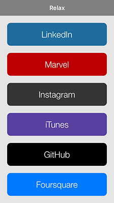

# Relax
RESTful API endpoint manager

<!--[](https://travis-ci.org/Jo Albright/Relax)-->
[](http://cocoapods.org/pods/Relax)
[](http://cocoapods.org/pods/Relax)
[](http://cocoapods.org/pods/Relax)

## Needs

> This library will need a lot of management to keep APIs updated. My plan is to start laying them out and try to find others who use specific APIs and have them keep those up to date.

## Roadmap


#### APIs

- [x] ~~Done~~
- [ ] ***Started***
- [ ] API : [Docs]() *documentation link*
- [x] ~~API~~ : [File]() *source file*
- [ ] API : [Lead Name]() *lead contributer* 

**Please submit an issue if you would like a lead position for any (listed/unlisted) API**

--

- [x] ~~Foursquare~~ : [Docs](https://developer.foursquare.com) : [File](APIs/FoursquareAPI.swift) : [Jo Albright](https://github.com/joalbright)
- [x] ~~Instagram~~ : [Docs](https://www.instagram.com/developer/) : [File](APIs/InstagramAPI.swift) : [Jo Albright](https://github.com/joalbright)
- [x] ~~iTunes~~ : [Docs](https://www.apple.com/itunes/affiliates/resources/documentation/itunes-store-web-service-search-api.html) : [File](APIs/ItunesAPI.swift) : [Jo Albright](https://github.com/joalbright)
- [x] ~~Marvel~~ : [Docs](http://developer.marvel.com) : [File](APIs/MarvelAPI.swift) : [Paul Vagner](https://github.com/PaulVagner)

--

- [ ] Flickr : [Docs](https://www.flickr.com/services/api/)
- [ ] ***Github*** : [Docs](https://developer.github.com/v3/) : [Jo Albright](https://github.com/joalbright)
- [ ] LinkedIn : [Docs](https://developer.linkedin.com/docs)
- [ ] Meetup : [Docs](http://www.meetup.com/meetup_api/)
- [ ] Pinterest : [Docs](https://developers.pinterest.com)
- [ ] Slack : [Docs](https://api.slack.com)
- [ ] Twitter : [Docs](https://dev.twitter.com/overview/documentation)
- [ ] Uber : [Docs](https://developer.uber.com)
- [ ] Youtube : [Docs](https://developers.google.com/youtube/)

--

**API Groups**

- [Google Products](https://developers.google.com/products/)
	- [ ] Analytics : [Docs](https://developers.google.com/analytics/)
	- [ ] Maps : [Docs](https://developers.google.com/maps/)
- [Facebook Products](https://developers.facebook.com/docs/)
	- [ ] Graph API : [Docs](https://developers.facebook.com/docs/graph-api)

**Please submit an issue for any APIs you would like to see added.**

---

#### Features

- [ ] Response Object Structure (still dreaming this up)
- [x] ~~Authentication Structure~~ *docs coming soon*
- [ ] AlamoFire Support (other?)

## Usage

To run the example project, clone the repo, and run `pod install` from the Example directory first.

Example project screens.




### Choose or Create API

Go [here](APIs) to choose a prebuilt API or create your own. The example below uses the prebuilt [GitHubAPI](APIs/GitHubAPI.swift).

### Use API

> You will need to [register an application](https://github.com/settings/applications/new). Then create a Keys.swift file (make sure to ignore the file if your repo is public).

**run a request**

```swift
let githubAPI = GithubAPI.session
        
// setup endpoint
    
var profile = GithubAPI.Endpoints.UsersNamed.endpoint
    
profile.pathpieces = ["username" : "joalbright"]
    
// run request
    
githubAPI.request(profile) {
   
   // object returned = $0.info 
   // error returned = $0.error 
	    
}

```

## Requirements

This pod uses [Encodable](https://github.com/joalbright/Encodable).

## Installation

Relax is available through [CocoaPods](http://cocoapods.org). To install
it, simply add the following line to your Podfile:

```ruby
pod "Relax"
```

Relax is also available through [Swift Package Manager](https://swift.org/package-manager/). Please take a look at the link to learn more about how to use SwiftPM.

```swift
import PackageDescription

let package = Package(
    name: "YOUR_PACKAGE_NAME",
    dependencies: [
        .Package(url: "https://github.com/joalbright/Relax.git", majorVersion: 0)
    ]
)
```

## Author

[Jo Albright](https://github.com/joalbright)

## License

Relax is available under the MIT license. See the LICENSE file for more info.
